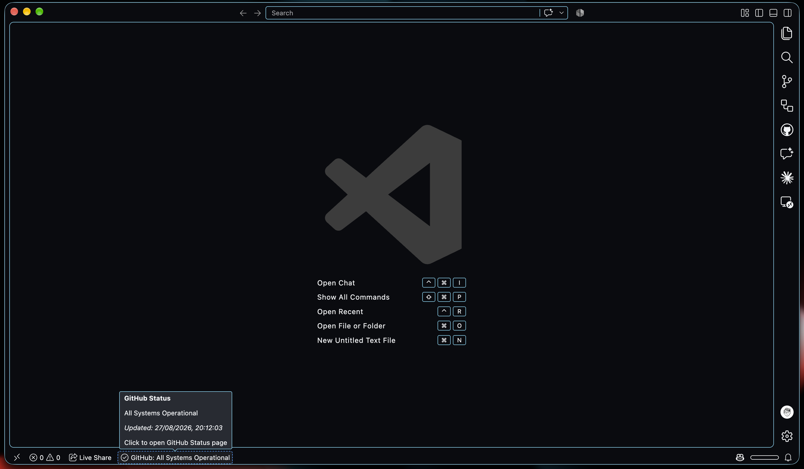

# GitHub Platform Status

A Visual Studio Code extension that displays the current GitHub platform status in the VS Code status bar. Stay informed about GitHub's service health without leaving your editor.

## Features

- 🟢 **Real-time Status Monitoring**: Displays GitHub's current platform status in the VS Code status bar
- 📊 **Status Indicators**: Visual indicators show the severity level:
  - ✅ All Systems Operational
  - ⚠️ Minor Issues
  - 🔴 Major Outage
  - 🛑 Critical Issue
- 🔄 **Automatic Polling**: Regularly checks GitHub's status API (configurable interval)
- 🎨 **Color-Coded Alerts**: Status bar changes color based on severity
- 🔗 **Quick Access**: Click the status bar item to open GitHub's status page
- 🎛️ **Configurable**: Adjust polling interval to suit your needs

## Screenshot



The extension displays GitHub's status in the VS Code status bar with a live update timestamp and quick access to the full status page.

## Installation

1. Open VS Code
2. Go to Extensions (Ctrl+Shift+X / Cmd+Shift+X)
3. Search for "GitHub Platform Status"
4. Click Install

## Usage

Once installed, the extension activates automatically on startup and displays the GitHub status in your VS Code status bar.

### Commands

- **GitHub Status: Refresh** - Manually refresh the status
- **GitHub Status: Open Status Page** - Open GitHub's status page in your browser

### Configuration

You can customize the polling interval by modifying the `githubStatus.pollIntervalMinutes` setting:

```json
{
  "githubStatus.pollIntervalMinutes": 5
}
```

Valid values: 1-60 minutes (default: 5 minutes)

## How It Works

The extension:
1. Fetches the current GitHub platform status from `https://www.githubstatus.com/api/v2/status.json`
2. Displays the status indicator and description in the VS Code status bar
3. Periodically refreshes according to your configured interval
4. Allows you to view the full status page with a single click

## Status Indicators

| Indicator | Icon | Meaning |
|-----------|------|---------|
| None | ✅ | All systems operational |
| Minor | ⚠️ | Minor service issues |
| Major | 🔴 | Major service outage |
| Critical | 🛑 | Critical service incident |

## Development

### Prerequisites

- Node.js 18+
- TypeScript 5.9+
- VS Code 1.134+

### Build

```bash
npm run compile
```

### Watch Mode

```bash
npm run watch
```

### Linting

```bash
npm run lint
```

### Package Extension

```bash
npm run package
```

## Requirements

- Visual Studio Code 1.134.0 or higher

## License

See LICENSE file for details
